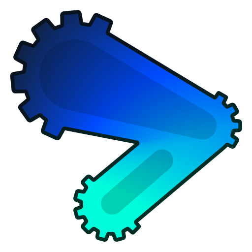

# ProtoShape - Godot Prototyping Extension for CSG

ProtoShape is a Godot plugin that adds a library of dynamic shapes based on Godot's Constructive Solid Geometry (CSG). It is designed to be used for prototyping levels and game mechanics.

## Installation

Install plugin from the AssetLib inside Godot or download the latest release from the [releases page](https://github.com/HLCaptain/proto-shape/releases/latest).

Enable the plugin inside Godot. `Project` -> `Project Settings` -> `Plugins` -> Enable `ProtoShape`.

## Usage

Add these shapes to your scene by searching for them in the `Add Child Node` menu.

### [ProtoRamp](addons/proto_shape/proto_ramp/README.md)

Ramp/staircase with adjustable height, width and length. Can adjust step count and various other parameters. Supports custom gizmos.

<video controls>
  <source src="addons/proto_shape/proto_ramp/assets/videos/supercut.mp4" type="video/mp4">
</video>

## Contributing

Feel free to open an issue for any bugs or feature requests. See more in [CONTRIBUTING.md](CONTRIBUTING.md).

The library is written in `GDScript` and (mostly) follows the [GDScript style guide](https://docs.godotengine.org/en/stable/tutorials/scripting/gdscript/gdscript_styleguide.html).

Extend the library of shapes by creating an issue or pull request! Share your idea for a shape or feature you would like to see added to the library.

If you find any bugs, feel free to create an issue.

## License

[MIT](https://choosealicense.com/licenses/mit/)
