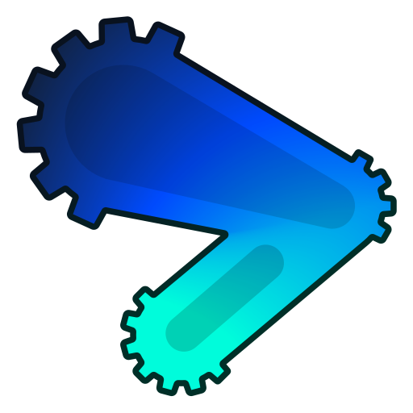

# ProtoShape - Ramps, Shapes and Gizmos

ProtoShape is a Godot editor plugin for fast 3D blockouts. It provides dynamic CSG ramps, staircases, path-driven walls and rails, plus reusable gizmo tooling for custom nodes.

[Feature Showcase](https://youtube.com/playlist?list=PL1C7-40JVAoKh9hsaS_wFPziyKAF1DTJ2&si=0ItpHT7-StKODXbC)

## Installation

ProtoShape 1.2.0 requires Godot 4.7 or later and is validated with Godot 4.7.2.

Install ProtoShape from the Asset Store inside Godot or download the latest package from the [releases page](https://github.com/HLCaptain/proto-shape/releases/latest).

Open the project once and wait for Godot's initial asset import to finish. Then enable the plugin from `Project` -> `Project Settings` -> `Plugins` -> `ProtoShape`.

## Usage

Add these shapes to your scene by searching for them in the `Add Child Node` menu.

### [ProtoRamp](addons/proto_shape/proto_ramp/README.md)

Ramp/staircase with adjustable height, width and depth. Adjust step count and other parameters with the Inspector or custom gizmos. Supports collision and navigation-mesh workflows.

https://github.com/HLCaptain/proto-shape/assets/22623259/730a527c-d6ba-4eaa-93b6-dbcbbd8aba52

> [!TIP]
> `ProtoRamp` supports [undo/redo](addons/proto_shape/README.md#undoredo-support) and [grid snapping](addons/proto_shape/proto_ramp/README.md#grid-snapping).

#### Grid snapping and fill

ProtoRamp features standard (1.0 unit) and fine (0.1 unit) grid snapping, besides making the ramp hollow to create an underpass.

https://github.com/user-attachments/assets/abb87cb9-2757-455d-8a05-6a6886eaed40

### [ProtoWall](addons/proto_shape/proto_wall/README.md)

Path-based solid walls and rails for fast level blockouts. Use it for straight or curved walls, low cover, guardrails, fences, balcony rails, ramp-side rails, and variable-elevation paths with selectable orientation and interpolation.

> [!TIP]
> `ProtoWall` extends `Path3D`, so you can shape walls and rails with Godot's native curve tools and adjust wall dimensions with ProtoShape gizmos.

### [ProtoGizmoWrapper](addons/proto_shape/proto_gizmo_wrapper/README.md)

Nest your custom nodes under the `ProtoGizmoWrapper` and start adding custom gizmo functionality with a few lines of code. Embrace the power of dragging your cursor on the screen, with all the complex 3D math handled for you with [ProtoGizmoUtils](addons/proto_shape/proto_gizmo/README.md#protogizmoutils).

Supports only `Node3D` nodes for now! Read the [documentation](addons/proto_shape/proto_gizmo_wrapper/README.md) to get to know gizmos and how to make your custom nodes compatible.

## Playable example

Open [Power Cell Delivery](addons/proto_shape/examples/power_cell_delivery/power_cell_delivery.tscn) for an editable prototype map built from varied `ProtoRamp` and `ProtoWall` configurations. Retrieve the power cell and deliver it to the relay terminal. This is a hands-on addon example, not a standalone game.

## Contributing

Feel free to open an issue for any bugs or feature requests. See more in [CONTRIBUTING.md](CONTRIBUTING.md).

The library is written in `GDScript` and (mostly) follows the [GDScript style guide](https://docs.godotengine.org/en/stable/tutorials/scripting/gdscript/gdscript_styleguide.html).

When adding new shapes, follow the [Shape Development Guide](addons/proto_shape/SHAPE_DEVELOPMENT.md).

## License

[MIT](LICENSE)
