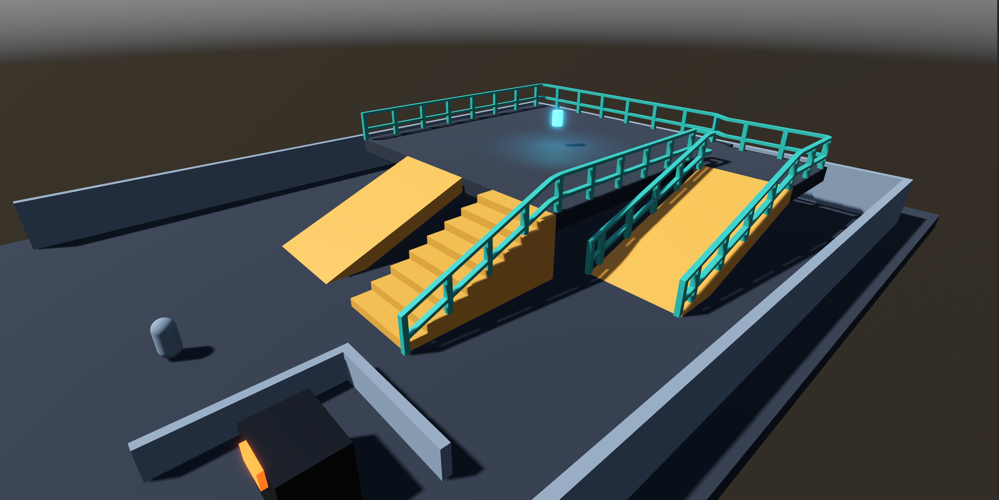

# Power Cell Delivery

A compact playable ProtoShape showcase. Take either the broad cargo ramp or the optional maintenance stairs, follow the elevated ProtoWall rails to the cyan power cell, then descend the hollow return ramp and insert the cell into the relay terminal.

## Controls

- Move: <kbd>WASD</kbd>, arrow keys, D-pad, or left stick.
- Jump: <kbd>Space</kbd> or controller A.
- Interact: <kbd>E</kbd> or controller X.
- Restart or recover from a fall: <kbd>R</kbd> or controller Start.
- Release the mouse: <kbd>Esc</kbd> or controller Back.

## Editing

The map is fully authored in [power_cell_delivery.tscn](power_cell_delivery.tscn). Its named `ProtoRamp`, `ProtoWall`, native CSG, trigger, and gameplay nodes are safe to move, reshape, rename, delete, save, and reload; no tool script regenerates or overwrites the scene.

The staircase is an optional route because the intentionally small demo character has no automatic stair-stepping. The adjacent cargo ramp is the required walkable route.

