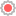

# ProtoGizmoWrapper

ProtoGizmoWrapper is a wrapper to create 3D gizmos for custom nodes in Godot. With the use of [ProtoGizmoUtils](../proto_gizmo/README.md#protogizmoutils) and only 2 method implementations, you can implement custom gizmos for your nodes.



## Usage

### Create ProtoGizmoWrapper

When adding a new child node, search for `ProtoGizmoWrapper` and add it to the scene.

### Make your nodes compatible with gizmos

ProtoGizmoWrapper exposes 2 essential methods as signals to implement gizmo functionality.

To make your nodes respond to gizmo related changes, you need to subscribe to these signals.

#### Redraw

This signal is emitted when a wrapper's child node's gizmos need to be redrawn.

When a `ProtoGizmoWrapper` has multiple child nodes (each subscribed to this signal), children should check if the affected node is itself with `gizmo.get_node_3d() == self`. Else, the children not affected are also redrawn, resulting in multiple (unnecessary) gizmos being drawn.

Propagating `EditorNode3DGizmoPlugin::_redraw`.

```gdscript
signal redraw_gizmos_for_child_signal(gizmo: EditorNode3DGizmo, plugin: EditorNode3DGizmoPlugin)
```

Each child is responsible to initialize their handles (generate UID for each handle, to use them later). In case of [ProtoRamp](../proto_ramp/README.md), the handles are initialized this way:

```gdscript
# For initializing gizmo handles
var width_gizmo_id: int
var depth_gizmo_id: int
var height_gizmo_id: int

# Optional variables for drawing debug grid for camera projection (assigned in `set_handle` function)
var screen_pos: Vector2
var local_gizmo_position: Vector3
var local_offset_axis: Vector3
var camera_position: Vector3

func redraw_gizmos(gizmo: EditorNode3DGizmo, plugin: EditorNode3DGizmoPlugin) -> void:

    # Check if this is the affected node
    if gizmo.get_node_3d() != self:
        return

    # Initializing gizmo handles
    if width_gizmo_id == 0 or depth_gizmo_id == 0 or height_gizmo_id == 0:
        width_gizmo_id = randi_range(0, 1_000_000)
        depth_gizmo_id = randi_range(0, 1_000_000)
        height_gizmo_id = randi_range(0, 1_000_000)

    # Clearing previous drawn gizmos
    gizmo.clear()

    var handles = PackedVector3Array()
    # ... calculate and add gizmo handle positions to the array
    gizmo.add_handles(handles, plugin.get_material("proto_handler", gizmo), [depth_gizmo_id, width_gizmo_id, height_gizmo_id])

    # Add selection with mouse click on screen by adding the node's mesh to the gizmo
    if get_meshes().size() > 1:
        gizmo.add_collision_triangles(get_meshes()[1].generate_triangle_mesh())
        gizmo.add_mesh(get_meshes()[1], plugin.get_material("selected", gizmo))

    # Drawing debug grid for camera projection (optional)
    # Adding debug lines for gizmo if we have cursor screen position set
    if screen_pos:
        var grid_size_modifier = 1.0
        gizmo_utils.debug_draw_handle_grid(camera_position, screen_pos, local_gizmo_position, local_offset_axis, self, gizmo, plugin, grid_size_modifier)
```

#### Set handle

This signal is emitted when a handle is dragged by the user.

With identifying the affected handle, being drawn by `handle_id` on the affected node `gizmo.get_node_3d()`, the node can update its properties accordingly with the use of [ProtoGizmoUtils](../proto_gizmo/README.md#protogizmoutils).

Propagating `EditorNode3DGizmoPlugin::_set_handle`.

```gdscript
signal set_handle_for_child_signal(gizmo: EditorNode3DGizmo, plugin: EditorNode3DGizmoPlugin, handle_id: int, secondary: bool, camera: Camera3D, screen_pos: Vector2)
```

```gdscript
func set_handle(
    gizmo: EditorNode3DGizmo,
    plugin: EditorNode3DGizmoPlugin,
    handle_id: int,
    secondary: bool,
    camera: Camera3D,
    screen_pos: Vector2) -> void:

    # Check if this is the affected node
    if gizmo.get_node_3d() != self:
        return

    # Assign debug parameters used for drawing camera projected debug planes (optional)
    self.screen_pos = screen_pos
    self.local_gizmo_position = child.global_transform.origin
    self.camera_position = camera.position

    # Match the handle_id to update the appropriate property
    match handle_id:
        depth_gizmo_id:
            # Use ProtoGizmoUtils to update depth

            # `local_offset_axis` is used for debugging reasons, so it is not a local variable defined with `var`
            # `local_offset_axis` is used to define the axis the handle can be dragged on.
            local_offset_axis = Vector3(1, 0, 0)
            # Also used for debugging
            local_gizmo_position = ... set gizmo position based on node properties

            # `gizmo_utils` is a reference to the `ProtoGizmoUtils` instance used for handle offset calculations
            # `handle_offset` is the offset of the dragged handle in the 3D space on a camera projected plane
            var handle_offset = gizmo_utils.get_handle_offset(camera, screen_pos, local_gizmo_position, local_offset_axis, self)

            # Update custom node properties based on offset in the proper axis
            _set_depth_handle(handle_offset.z)
        width_gizmo_id:
            # ... update width
        height_gizmo_id:
            # ... update height

    # Redraw gizmos after updating the properties
    update_gizmos()
```

#### Initializing your nodes

To use gizmos and `ProtoGizmoUtils` for getting handle offsets, you need to initialize an instance of it in your node, for example:

```gdscript
# Import ProtoGizmoWrapper and ProtoGizmoUtils
const ProtoGizmoWrapper = preload("res://addons/proto_shape/proto_gizmo_wrapper/proto_gizmo_wrapper.gd")
const ProtoGizmoUtils = preload("res://addons/proto_shape/proto_gizmo/proto_gizmo_utils.gd")
var gizmo_utils := ProtoGizmoUtils.new()

func _enter_tree() -> void:
    if get_parent() is ProtoGizmoWrapper:
        # Connect to ProtoGizmoWrapper signals
        var parent: ProtoGizmoWrapper = get_parent()
        parent.redraw_gizmos_for_child_signal.connect(redraw_gizmos)
        parent.set_handle_for_child_signal.connect(set_handle)

func _exit_tree() -> void:
    if get_parent() is ProtoGizmoWrapper:
        # Disconnect from ProtoGizmoWrapper signals
        var parent: ProtoGizmoWrapper = get_parent()
        parent.redraw_gizmos_for_child_signal.disconnect(redraw_gizmos)
        parent.set_handle_for_child_signal.disconnect(set_handle)
```

### Setup node hierarchy

Add your custom nodes under the `ProtoGizmoWrapper` node, for the `ProtoGizmo` *EditorNode3DGizmoPlugin* to pick it up as a node with gizmos enabled.

When your node connects to the `ProtoGizmoWrapper` signals, it will start responding to gizmo related changes, called by `ProtoGizmo`.

If you implemented your functions correctly, you should see the gizmos for your 3D nodes and be able to drag them around.