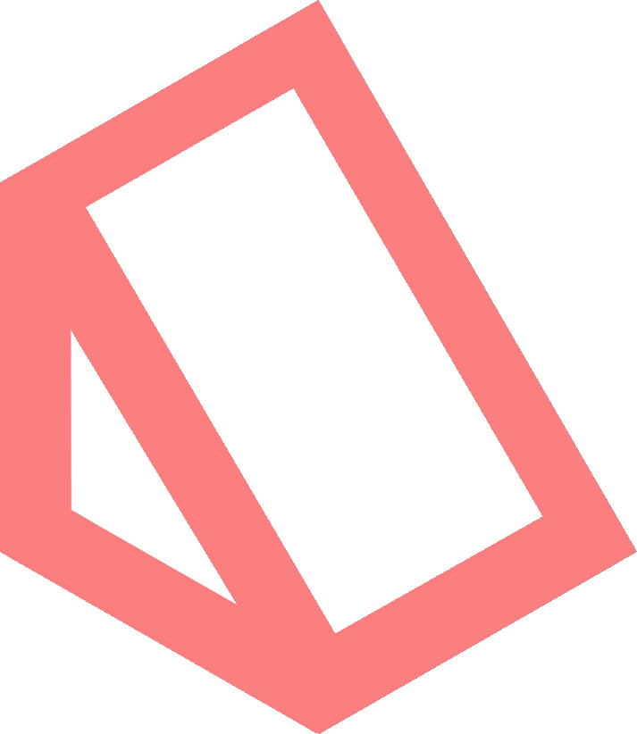
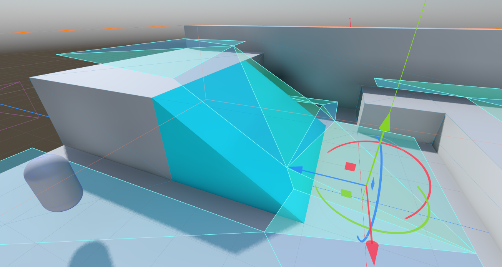

# ProtoRamp

ProtoRamp is a dynamic ramp/staircase shape based on Godot's Constructive Solid Geometry (CSG). It is designed to be used for prototyping levels and game mechanics.

<!-- Icon (addons/proto_shape/proto_ramp/icons/proto-ramp-icon.png) -->

## Usage

### Create a ProtoRamp

When adding a new child node, search for `ProtoRamp` and add it to the scene.

https://github.com/HLCaptain/proto-shape/assets/22623259/bccfb0e7-6799-4a94-82c4-84e5aa9d9563

Since `1.1.4`, ProtoRamp node is now independent from `CSGShape3D` base class for correct shape generation.

### Run the example

Open [proto_ramp_example.tscn](example/proto_ramp_example.tscn), or run this repository directly. Move with <kbd>WASD</kbd> or the arrow keys, jump with <kbd>Space</kbd>, look around with the mouse, and press <kbd>Esc</kbd> to release the cursor. Click to capture it again.

### Use Gizmos

ProtoRamp supports custom gizmos to adjust the shape. Solid 3D arrows start at each handle icon and point in the direction the handle can be dragged. Hovering an arrow highlights it, and dragging the arrow body edits the same property as the small handle icon.

Width, total height, and total depth stay at least `0.001`. In `Step Dimensions` mode, the stored height and depth describe one step, so they may be smaller than `0.001` while the complete staircase remains at least `0.001`. Switching calculation mode or shape type preserves the complete shape dimensions.

`Calculation` and `Steps` are hidden while the node is a ramp, but their values are retained when switching types or saving and reopening the scene.

https://github.com/HLCaptain/proto-shape/assets/22623259/1db3f18d-4d90-400f-9d33-7b03d44f62c7

#### Undo/Redo

You can also undo/redo changes made with the gizmos.

### Enable collisions and bake Navigation Meshes

ProtoRamp supports navigation mesh generation. It also features a toggle to enable collisions (aqua blue if enabled).

#### ProtoRampGizmos

Gizmo functionality is delegated to [ProtoRampGizmos](proto_ramp_gizmos.gd). It is a provider class returned by `ProtoRamp.get_proto_gizmo_provider()` and only gets instantiated in the editor. This way, the packaged game will not rely on any editor-plugin specific code.

`Engine.is_editor_hint()` is used in `ProtoRamp` itself to check if the game is running in the editor. If it is, the `ProtoRampGizmos` class is instantiated and stored as the ramp's gizmo provider.

### Adjust parameters

Modify height, width, depth, anchor position and more!

https://github.com/HLCaptain/proto-shape/assets/22623259/cee061ee-5c15-4e56-9c48-6eedb77409db

### Grid snapping

Grid snapping is supported for `ProtoRamp` since `1.1.3`! Holding down <kbd>Ctrl</kbd> enables regular snapping by 1.0 units (ramp size, not node scale unit), while holding down <kbd>Ctrl</kbd> + <kbd>Shift</kbd> enables fine snapping by 0.1 units.

### Change step counts in multiple ways

There are two ways of changing the step count:

- Fitting into `Staircase` dimensions: current width-height-depth of the staircase is respected, step dimensions will adjust.
- Using `Step` dimensions as a base: step dimensions are constant, staircase will shrink or grow to fit the steps.

Fitting in more steps:

https://github.com/HLCaptain/proto-shape/assets/22623259/f14dd269-fa6b-4ee7-a195-23d64c7cb15a

You can also use both!

https://github.com/HLCaptain/proto-shape/assets/22623259/1fdcc87e-3231-4c03-bc8f-ab0252557574
