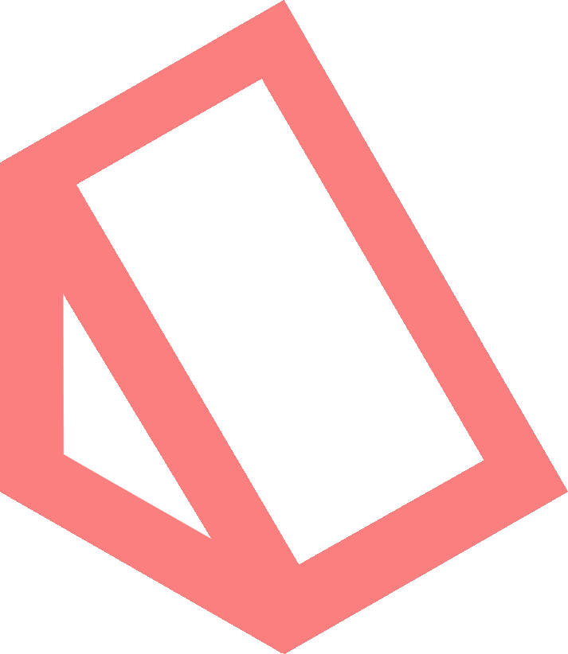

# ProtoRamp

ProtoRamp is a dynamic ramp/staircase shape based on Godot's Constructive Solid Geometry (CSG). It is designed to be used for prototyping levels and game mechanics.

<!-- Icon (addons/proto_shape/icon/proto-ramp-icon.png) -->

## Usage

### Create a ProtoRamp

When adding a new child node, search for `ProtoRamp` and add it to the scene.

https://github.com/HLCaptain/proto-shape/assets/22623259/bccfb0e7-6799-4a94-82c4-84e5aa9d9563

### Use Gizmos

ProtoRamp supports custom gizmos to adjust the shape.

https://github.com/HLCaptain/proto-shape/assets/22623259/1db3f18d-4d90-400f-9d33-7b03d44f62c7

### Adjust parameters

Modify height, width, depth, anchor position and more!

https://github.com/HLCaptain/proto-shape/assets/22623259/cee061ee-5c15-4e56-9c48-6eedb77409db

### Change step counts in multiple ways

There are two ways of changing the step count:

- Fitting into `Staircase` dimensions: current width-height-depth of the staircase is respected, step dimensions will adjust.
- Using `Step` dimensions as a base: step dimensions are constant, staircase will shrink or grow to fit the steps.

Fitting in more steps:

https://github.com/HLCaptain/proto-shape/assets/22623259/f14dd269-fa6b-4ee7-a195-23d64c7cb15a

You can also use both!

https://github.com/HLCaptain/proto-shape/assets/22623259/1fdcc87e-3231-4c03-bc8f-ab0252557574
